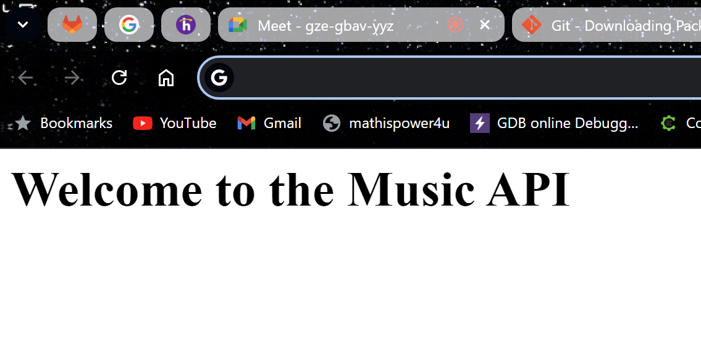

# Milestone 1

- This is Milestone 2, blah blah 



1. Item 1
2. Item 2
3. something
   1. Indented Item 1
   2. Indented Item 2
   3. Indented Item 3
4. Item 4

|First Name|Last Name|
|--|--|
|Gloria|Quezada|
|Bobby|Estey|

```Java
public class CodeBlock {
    public static void main(String[] args) {
        System.out.println("Code Block Example");
    }
}
```
