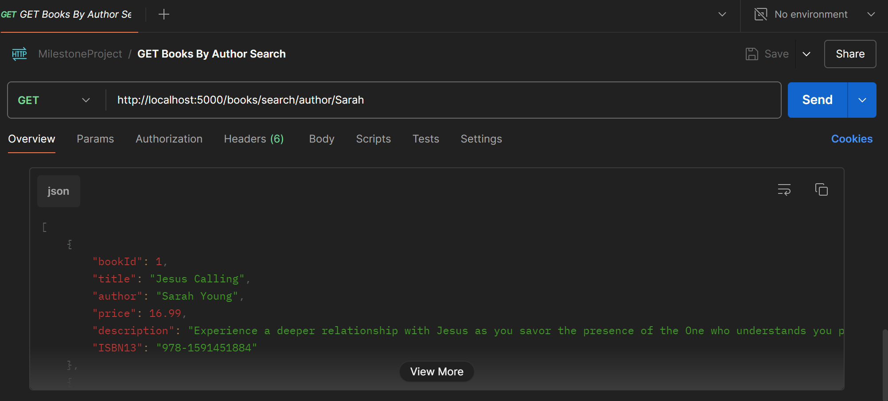

# Milestone 3  - REST API using Express Framework

## GIT Repository Link 
[Application Source Code](https://github.com/qloriaa/cst391/tree/main/MilestoneProject)

## Milestone PowerPoint
[Presentation Link](https://docs.google.com/presentation/d/1ZOUEjsWjGWI_JA4Jj_TjzAo_ZWL8ETZdJQwtTxtlVdY/edit?usp=sharing)

## Milestone Screencast
[Video 1 - Postman](https://www.loom.com/share/a8903d4a69df4c5b9fc2f25c43810a22?sid=8c88e528-2ca4-40ff-b684-2e6b06604f58)

[Video 2- MySQL and API Code](https://www.loom.com/share/458668ae96db4028a348f48ca9a31f18?sid=c3963f85-0cb7-4a99-9a5d-53fd2128fc92)

[Video 3 - Presentation](https://www.loom.com/share/d51b3991df794a42b80d21a144a5ca59?sid=1fac09da-8868-4b0c-8a87-8081ec672a19)

## Postman Documentation for CRUD Operations
[API Requests](https://www.postman.com/telecoms-candidate-95543226/workspace/cst-391-js-web-app-dev/collection/32474471-91631e8c-7892-47b7-9470-aa68daaefb62?action=share&source=copy-link&creator=32474471)

- GET Books *

- GET Books By Author

- GET Books By Author Search

- GET Books By Title Search

- GET Books By Id

- POST Create Book

- PUT Update Book

- DELETE Book By Id

## Next Steps
- User Interface:
    - Implement designed home page
    - Implement products page by creating a container to hold product information.
    - Create admin page that will allow to create, update, and delete products.

### Resources:

Grand Canyon University. (n.d.). CST-391 Milestone 1 Guide. GCU. https://halo.gcu.edu/resource/a63d56d6-5733-40b8-ad74-98c63ba9d9b6 

Grand Canyon University. (n.d.). CST-391 Activity 1 Guide. GCU. https://mygcuedu6961.sharepoint.com/:w:/r/sites/CSETGuides/_layouts/15/Doc.aspx?sourcedoc=%7BA0605166-4D8D-49D4-9602-49579C0AD659%7D&file=CST-391-RS-Activity1Guide.docx&action=default&mobileredirect=true

Grand Canyon University. (n.d.). CST-391 Activity 2 Guide. GCU. https://mygcuedu6961.sharepoint.com/:w:/r/sites/CSETGuides/_layouts/15/Doc.aspx?sourcedoc=%7B6412A17F-AF27-4D6C-A7D4-152A762D79D4%7D&file=CST-391-RS-Activity2Guide.docx&action=default&mobileredirect=true

Grand Canyon University. (n.d.). CST-391 Milestone 3 Part 1 Guide. GCU. https://halo.gcu.edu/resource/d8227b83-ae5b-4a5e-9f68-4c230b5c89a3

