# CTS-391 Topic 3: Angular Modules and Components
# Activity 3 Report

## Part 1 : Basic Angular Components, Events, Routes, and Data Binding

### Research

**@Input** decorator (as used in info.component.ts) :

```typescript
    @Input() name: string = '';
```
- The @Input decorator allows a parent component to share data with a child component. In this case, the parent is the **shop** component passing the name received from the form to the child **info** component. In a similar manner, an **@Output** decorator can be used to share information from a child component to a parent component. 

**[value]** (as used in info.component.html) :

```html
    <option *ngFor="let product of products"[value]="product">{{product}}</option>
```

- In this line of code, the **value** property is identified as a target property. Square brackets **[ ]** are used for property binding. Binding is useful to accomplish things like toggle button features, set paths programmatically, and share values between components. With out the brackets, the value of the **value** property would be set to the string literal "*product*". 

**[(ngModel)]** (as used in info.component.html) :

```html
<input type="text" class="form-control" id="quantity" required [(ngModel)]="quantity" name="quantity">

...
<select class="form-control" id="products" required [(ngModel)]="selectedProduct" name="products" #selected="ngModel">
    
```
- The **[(ngModel)]** syntax sets a data-bound property, in this case the **quantity** and the **selectedproduct** properties. The NgModel sets a two-way data binging using the parenthesis nested in brackets **[( )]**. The NgModel directive is used to display a data property and update it when the user makes changes. In this example, the default quantity and selectedProducts are "*0*" and "*Star Wars*". However, after makes a selection the new values are updates and displayed in the view even if the user has not selected submit. 

### Application Screenshots

Using a Bootstrap and Popper JS in our **simpleapp** application we can create responsive UI. In this example we used a Bootstrap [grid template](https://getbootstrap.com/docs/5.2/layout/grid/#stacked-to-horizontal) to display a responsive grid that will adjust according to the screen size. The following images displays the responsive grid using Chrome Dev Tools screen view.


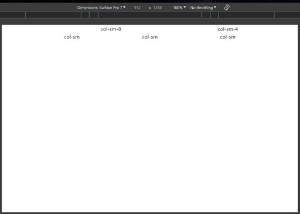

*Figure 1. Dimensions set for a laptop screen resulting with the intended 2 row grid. The first containing 2 columns, and the second containing 3.*

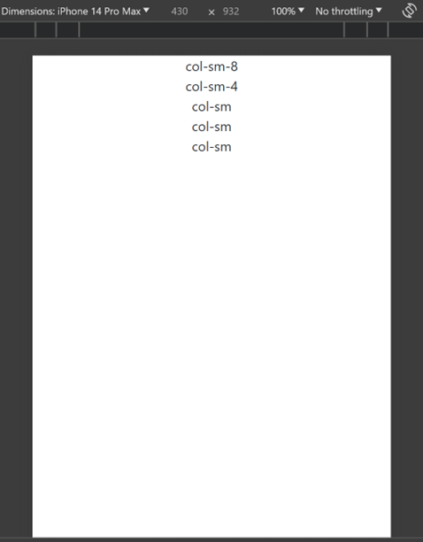

*Figure 2. Dimensions set for a phone screen resulting with the grid displaying as a 5 by 1 grid.*


In the same application, two components were created to receive user input. The parent **shop** component is meant to display a form to receive a name value from the user. The child **info** component receives the name value from the parent component to display, and waits for user product input, product and quantity. For now, the user interactions are displayed in the console. The following images demonstrate the application's function. 

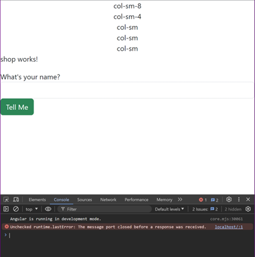

*Figure 3. Initial page display. The rest of the form will appear after a name has been entered by the user.*

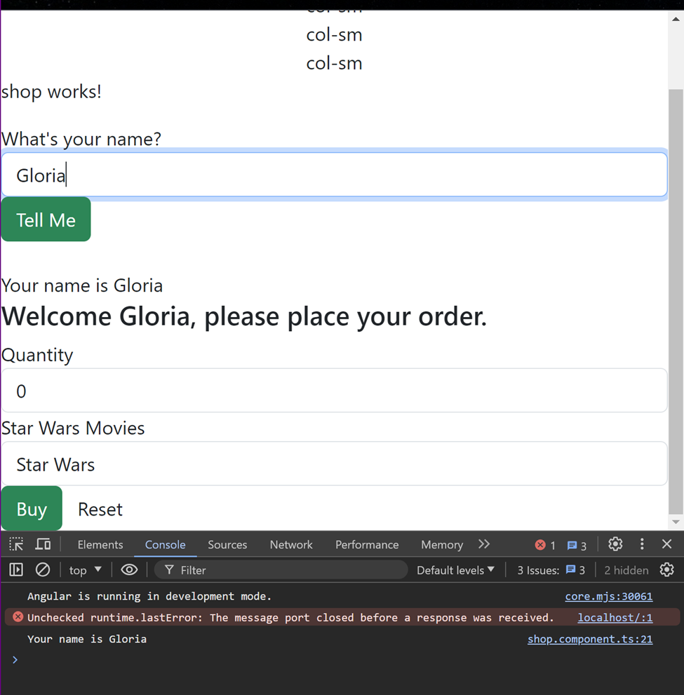

*Figure 4. Page display after name submission. The form content to place an order will appear prompting the customer by name.*

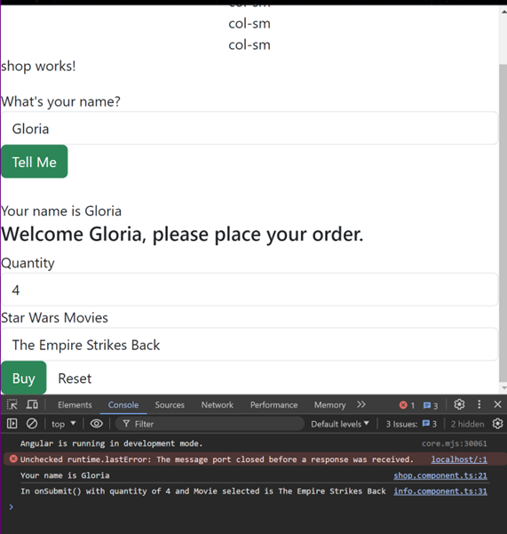

*Figure 5. After order input is received from the user, the order summary is displayed in the console.*


## Part 2 : Creating a Music Application - The Front End

### Research 

- Add complete comments to
[music-service.service.ts](../musicapp/src/app/service/music-service.service.ts).

### Application Screenshots 

This Part of the Activity is a continuation of the MusicApp created in a previous Activity. For this part we implemented multiple components, handled page events, and bound data to a view template. The 
[create-album](../musicapp/src/app/create-album/create-album.component.ts), 
[display-album](../musicapp/src/app/display-album/display-album.component.ts),
[list-albums](../musicapp/src/app/list-albums/list-albums.component.ts), 
and
[list-artists](../musicapp/src/app/list-artists/)
components were created and implemented; while the
[edit-album](../musicapp/src/app/edit-album/edit-album.component.ts)
and
[delete-album](../musicapp/src/app/delete-album/delete-album.component.ts)
components still need to be completed. We also created the model files for 
[albums](../musicapp/src/app/models/albums.model.ts),
[artists](../musicapp/src/app/models/artists.model.ts), and
[tracks](../musicapp/src/app/models/tracks.model.ts). Last but not least, an assets directory was created with an [images](../musicapp/src/assets/images/)
folder and an app [service](../musicapp/src/app/service/music-service.service.ts) was implemented to perform the application request logic.

The following images demonstrate the application's current functionalities.

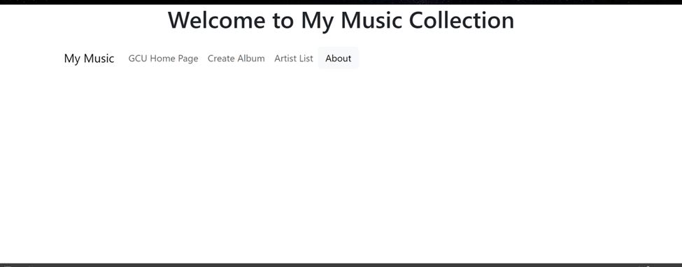

*Figure 6. Application Initial Page upon initialization. The user can interact with all tabs in the navigation bar. The First tab **My Music** will reload this screen.*

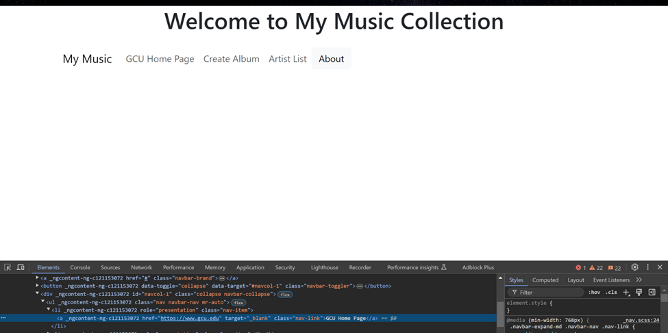

*Figure 7. The Second tab **GCU HOME Page** will redirect the user to the official GCU Website Homepage using the 
"https://www.gcu.edu" link as the hypertext reference attribute*


*Figure 8. This image shows the screen redirected to the GCU Website Homepage.*

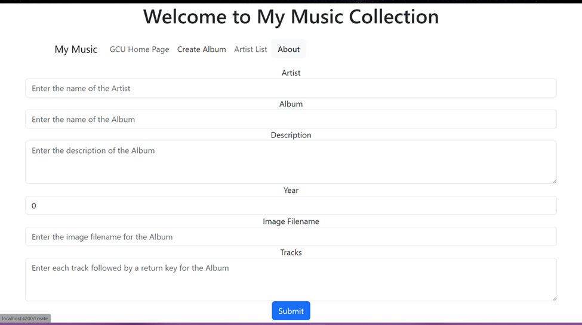

*Figure 9. The Third navigation tab redirects the user to the Create Album form. This page requires the user to fill out the information to add a new album when clicking **Submit**.*

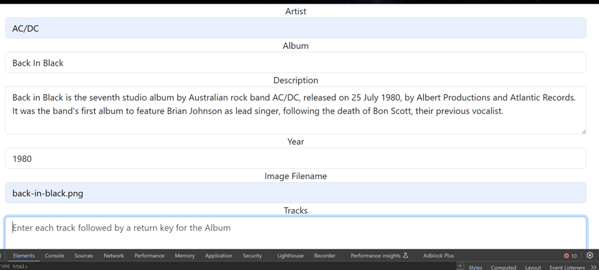

*Figure 10. The image shows the values input by the user to create a new Album. Note: The function to list Tracks for a selected album is not yet implemented, so this is left blank.*

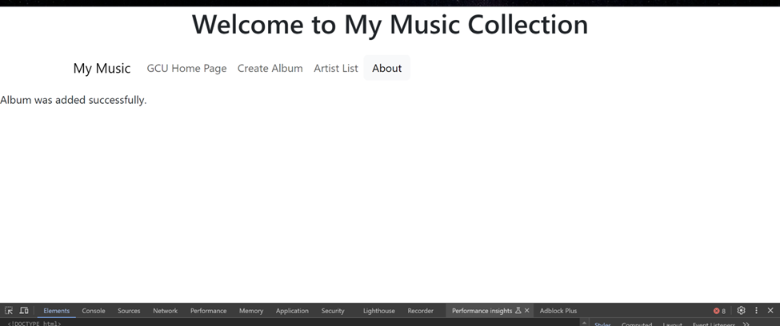

*Figure 11. After the Album is created, the page will display a success message to the user.*

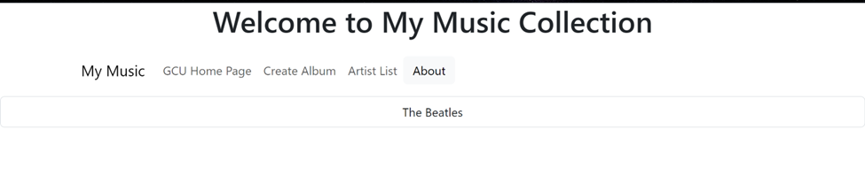

*Figure 12. The Fourth navigation tab redirects the user to a page that lists all the Artists in the collection. Before the previous Album was created, the list consisted of only one Artist, "The Beatles".*

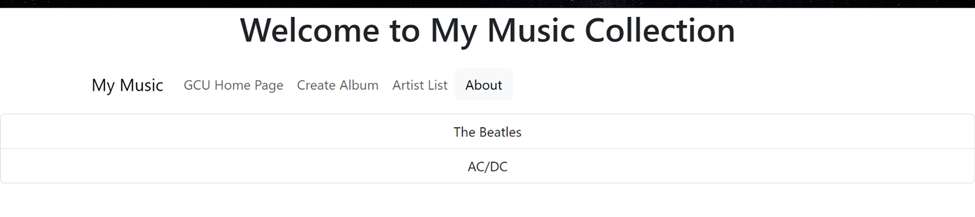

*Figure 13. This image shows the new **Artist List** after creating the new album from figure 10.*

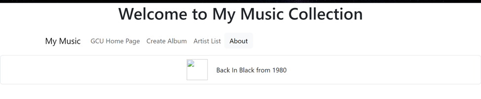

*Figure 14. Clicking on any Artist from the list will return a list of Albums by the selected Artist. In this image, the Artist "AC/DC" was selected and resulted in a list of one album.*

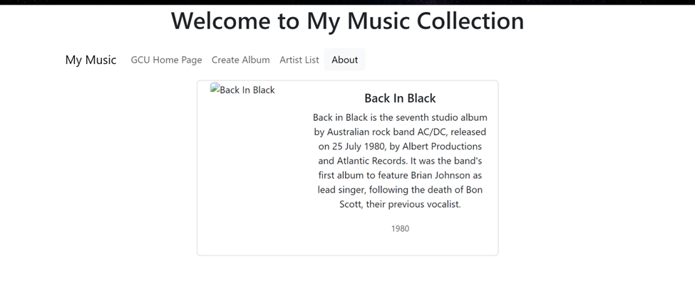

*Figure 15. From the resulting Album List, an Album can also be selected to display the Album's details. This image shows the Album's details matching the details input in figure 10.*

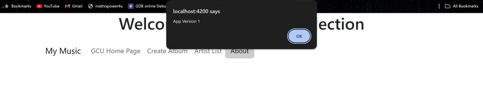

*Figure 16. The Fifth navigation tab is the **About** tab which triggers an alert box displaying the application's version information.*

**Note:** As mentioned, the application has an 
[assets](../musicapp/src/assets/) 
directory that includes an **images** folder with the album covers. The html view files for the components implemented include \ tags to display these images next to their according Album. I am still working on figuring out why the images are not displaying correctly. I have changed the file paths within the html tags, changed the **assets** properties inside the 
[angular.json](../musicapp/angular.json)
file and nothing seems to work. This is a pending bug that I will keep working on. 

## References

Grand Canyon University. (n.d.). CST-391 Activity 3 Guide. GCU. https://mygcuedu6961.sharepoint.com/:w:/r/sites/CSETGuides/_layouts/15/Doc.aspx?sourcedoc=%7B5f69810d-cb6d-4c80-a346-b617e6bdb791%7D&action=view&wdAccPdf=0&wdparaid=1A57CD0E

*Injectable*. (n.d.). Angular. https://v17.angular.io/api/core/Injectable

*NgModel*. (n.d.). Angular. https://v17.angular.io/api/forms/NgModel

*Built-in Directives - Displaying and updating properties with ngModel*. (n.d.). Angular. https://angular.dev/guide/directives#displaying-and-updating-properties-with-ngmodel

*Property Binding*. (n.d.). Angular. https://v17.angular.io/guide/property-binding

*Sharing data between child and parent directives and components*. (n.d.). Angular. https://v17.angular.io/guide/inputs-outputs 

*Understanding dependency injection*. (n.d.). Angular. https://v17.angular.io/guide/dependency-injection 

*Angular workspace configuration : Extra build and test options* (n.d.). Angular. https://angular.dev/reference/configs/workspace-config#extra-build-and-test-options 
