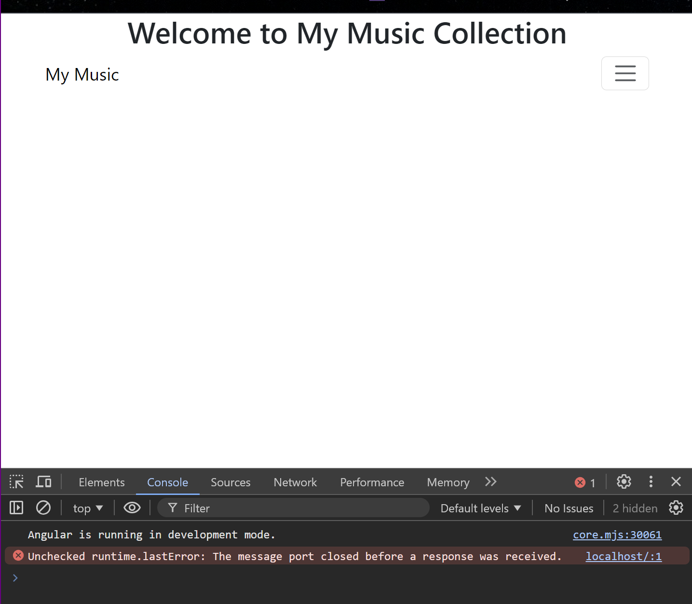
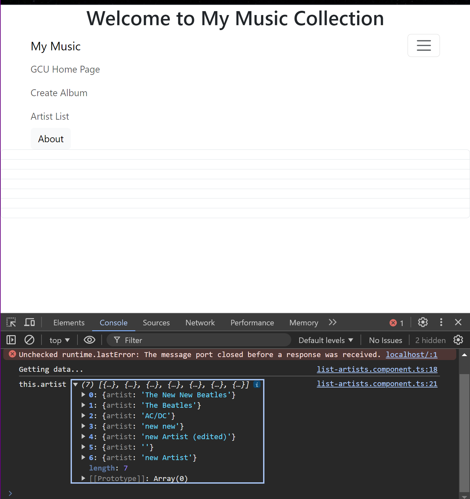
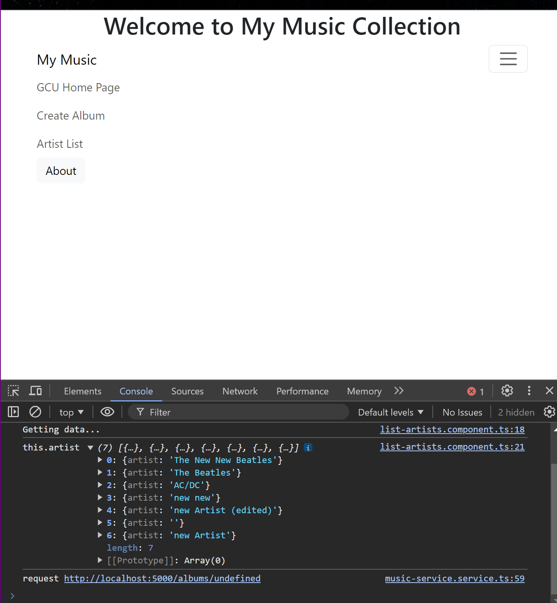
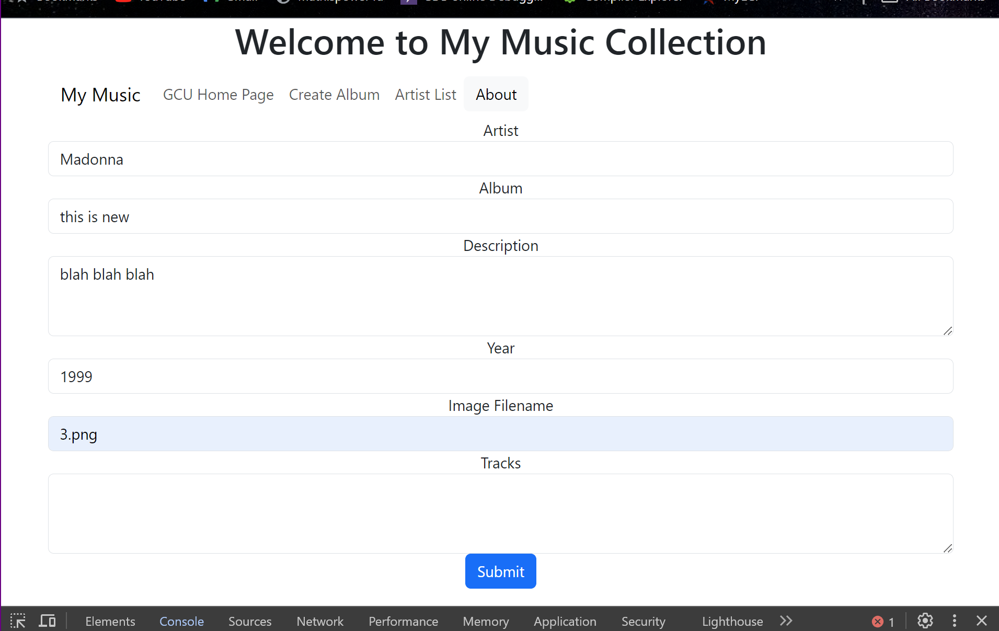
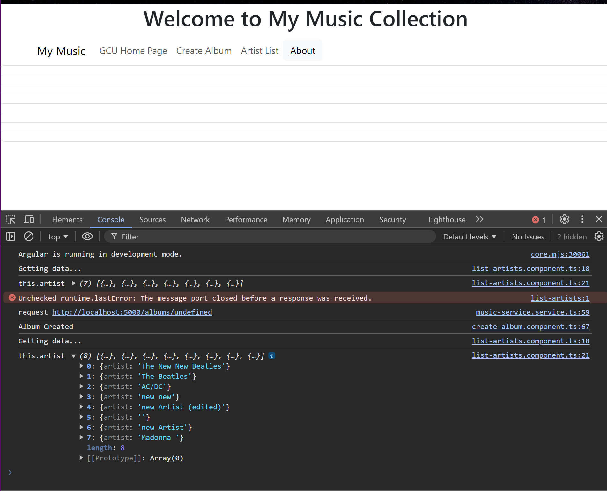
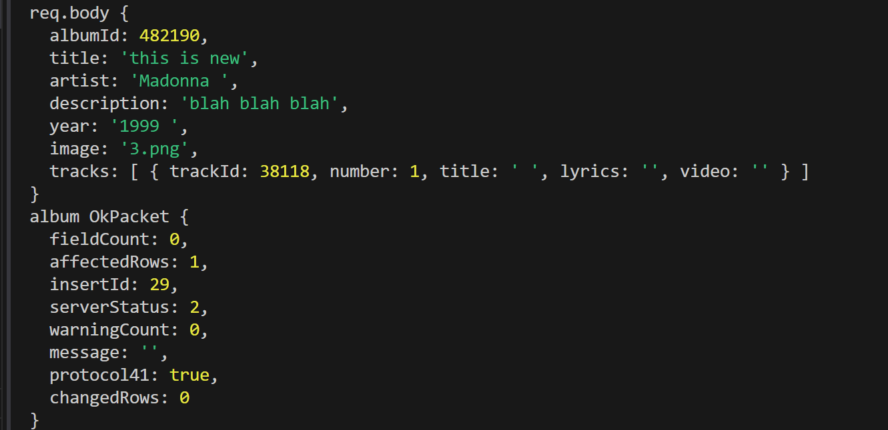

# Activity 4 - Angular Music App API Data

## Finish the Music Application - Integration with Back End

In this activity, we are connecting our application to the previously created 
[MusicAPI](../../week1/MusicAPI/)
to join out back-end and front-end apps as one. The Angular app (front-end) will pass and receive data to/from the api through routing requests. 

### Application Screenshots:

*Figure 1. The application does not display any content upon initialization.*

*Figure 2. Although I had issues converting the data, this applications demonstrates that a successful connection with the database was created. The image has the table <td> objects, one for each artist, but they remained blank.*

*Figure 3. After a <td> object representing an artist is selected, an http request is made but it uses the wrong uri, "albums/undefined".*

*Figure 4. The Create Album displays a form to add a new album to the database. The tracks are added by typing the Track values, one track per line.*

*Figure 5. This image demonstrates that the new album is successfully added to the database. The new album artist, "Madonna" is now part of the list of artists.*

*Figure 6. This figure also shows the terminal output to the API request to add the new Album.*

### Research:

Research how an Angular application maintains a logged in state. How does it communicate this state to the server?

- Angular session prevents unauthorized access and enhances application security. It also improves user experience with seamless session continuity. The Angular auth guard function helps a lot when it comes to handling authentication. It is an interface that instructs the router whether or not to enable navigation to a specific route.

Here are the steps:
1. Create a secure login form for user credentials in Angular.
2. Send login credentials to the backend API for validation.
3. Receive a session token from the server upon successful authentication.
4. Store the session token securely in the client (e.g., in cookies or local storage).
5. Attach the session token to HTTP headers for subsequent requests.
6. Use Angular interceptors to manage session token handling automatically.
7. Implement session timeout and auto-logout for inactive users.
8. Securely delete the session token on logout or session expiration.

### Resources:

Grand Canyon University. (n.d.). CST-391 Activity 4 Guide. GCU. https://mygcuedu6961.sharepoint.com/:w:/r/sites/CSETGuides/_layouts/15/Doc.aspx?sourcedoc=%7B0B366763-190B-4527-B080-504D6627FD91%7D&file=CST-391-RS-Activity4Guide.docx&action=default&mobileredirect=true

Panchal, K. (13 May 2021). *Angular Login with Session Management*. iFour. https://www.ifourtechnolab.com/blog/angular-login-with-session-authentication

