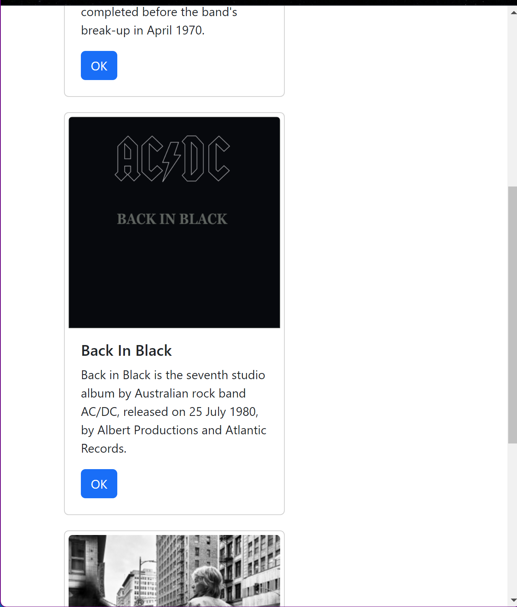

# Activity 5: React Tool & Music App Fixed Data

## Part 1: React Music App Introduction
 
### Stopping Point #1 - Custom Components

At this point in the application, we have created a basic React Music application. So far, the application has the 
[App](/week5/report-images/app-pt1.png) 
and 
[Card](/week5/music/src/Card.js)
components that are used to display the user 3 different music albums, and their basic information. The Albums are displayed using 
[Bootstrap's](https://www.bootstrapcdn.com/)
[Card](https://getbootstrap.com/docs/5.0/components/card/)
layout. The application works as follows:

1. The application displays the [index.html](./music/public/index.html) 
file to the browser. In this file, the 
`<div id="root></div>` element is displayed inside the body tags. The #root will be the entry point for all the JavaScript files we have created and the application will render its contents in this element.
2. In the [index.js](./music/src/index.js) component,
the ReactDOM render() method is used to render the component into the DOM node with the id *root*. 
    - Note: The line
`ReactDOM.render(<App />, document.querySelector("#root"));` is usually called once in a React application in thr root JavaScript file.
3. In the application, we also created custom components. The html line in the *index.js* file renders the `<App />` component defined in the 
[App.js](./music/src/App.js)
file. In this file we import the **Card** component and use its properties to hardcore initialize three separate Album Cards.
4. The [Card.js](./music/src/Card.js)
file is a template **Card** component that can be reused throughout the application when the component is imported. This file does not hardcore initialize any data, and will reply on initialization of the *props* properties to correctly display content to the browser.  

### Activity Screenshots


*Figure 1. The application displays the App's title followed by the Albums using the Card template designed in the Card.js file.*


*Figure 2. The application so far has 3 hardcoded albums to display. The data is hardcoded by initializing the Card template properties in the App.js file.*

## Mini App #1 - State Changer Demo

This activity was created to demonstrate the use of state, props, and methods to update the state of an application. The **statechanger** demo app includes the th root
[index.js](./statechanger/src/index.js) file along with the *App.js* and *Counter.js* components. 

The [Counter.js](./statechanger/src/Counter.js) is a template component file that includes two hooks and methods to update the state for number of clicks and of a string message. The user can click a button in the Counter to increase a click count by one and/or edit the string in a textbox to change the Counter's message.
The [App.js](./statechanger/src/App.js) file creates the three counters initializing their respective titles. 

### Activity Screenshots


*Figure 3. This is the browser output upon initialization. The clicks all start at 0, and the messages are set to the Counter title by default.*


*Figure 4. The application is capable of using a Counter template to create three separate Counters each holding its own independent states. In this figure, the 1st Counter's button was clicked six times, the 2nd Counter four times, and the 3rd Counter thirteen times. Each Counter increased and displayed its click count independently after each button click without it affecting the other counts.*


*Figure 5. In the same manner as explained in figure 4, the textbox in each Counter can be edited to update its message. The image shows the altered messages in the !st and 2nd Counters, while the 3rd Counter remained unchanged.*

## Part 2: Using State and Props in the Music Application

### Stopping Point #2 - State and Props

Write a one-paragraph summary of the new features that have been added. Define new terminology that was used in the lesson

In this part of the activity, we introduce the use of state, props, and methods to update the state the albums. In the 
[App.js](./statechanger/src/App.js) 
a hook for an AlbumsList is created to change the state of the list of albums. For now, these albums include the three hardcoded albums shown in Part 1, but this list will grow with the albums read externally requiring the implementation of the code that will use the **setAlbumList** hook.

The **App.js** file includes a method that uses *albumsList* to render a new array of album Cards using the *map()* function. This method used the *title*, *description*, and *image* props to create a Card component for each entry in *albumList*. 

```typescript 
const renderedList = () => {
    return albumList.map((album) => {
        return (
            <Card
                albumTitle= {album.title}
                albumDescription= {album.description}
                buttonText= "OK"
                imageUrl= {album.image}
            />            
        );
    });
};
```
*Figure 6. RenderedList() function in App.js*

The [App.css](./music/src/App.css) 
file was added to create a stylesheet template for the application. The file includes formats for all *container* and *card* elements. The *container* element is the returned element from **App** content including the array of Card components. 

`return <div className='container'>{renderedList()}</div>;`

The .css file adds the flex-wrap property to allow the containers to wrap. The second format is added to the *card* elements, which is the element returned from the 
[Card](./music/src/Card.js) component.

`return (<div className="card" style={{width: '18em'}}>  ...   </div>);`

For this element, the .css file adds the margin and padding properties to create a more aesthetically pleasing spacing between cards.

### Activity Screenshots


*Figure 7. The final application look for this activity demonstrated by this image. The Albums are demonstrated as spaced flex-wrapped Cards in a full screen browser.*


*Figure 8. The image displays the spaced flex-wrapped Cards in a browser reduced in size to half the screen. The cards to not shrink in size, instead the third card that does not fit in the browser display wraps around under the other two.*



*Figure 9. The image displays the spaced flex-wrapped Cards in a browser reduced in size to a third of the screen. The cards to not shrink in size, instead the second and third cards that do not fit wrap around. This results to each card being displayed under the previous.*

## Resources:

Grand Canyon University. (n.d.). *CST-391 Activity 5 Guide*. GCU. https://mygcuedu6961.sharepoint.com/:w:/r/sites/CSETGuides/_layouts/15/Doc.aspx?sourcedoc=%7BF69FCB75-3C1B-4E91-85AC-E1477C6C09BA%7D&file=CST-391-RS-Activity5Guide.docx&action=default&mobileredirect=true

*Lists and Keys*. (n.d.). React. https://legacy.reactjs.org/docs/lists-and-keys.html

*Array.prototype.map()*. (n.d.). mdn web docs. https://developer.mozilla.org/en-US/docs/Web/JavaScript/Reference/Global_Objects/Array/map 

*ReactDOM*. (n.d.). React. https://legacy.reactjs.org/docs/react-dom.html

