# Activity 6 - React Music APP API Data

## Part 3 - External Data Source

In this Activity part 3, we have transitioned our application from using a JSON file to using our
[Express Music API](../week1/MusicAPI/)
created in Activity 1. Using the API, we can now use our application to display all Albums and display Albums whose description match a search term.

In this part, the
[dataSource.js](./music/src/dataSource.js)
uses the the 
[axios.create()](https://axios-http.com/docs/instance)
function to create a new instance (in this case of the API service) and have two services running. We have also added the 
[SearchForm.js](./music/src/SearchForm.js)
file to create a Search Form component that includes a "Search for:" header and a textbox for user input. This component only requires to handle the text input and submission, and therefore only requires one *setInputText* hook. The search term (*inputText*) is updated using a **handleChangeInput** event function, and the search is performed by the **handleFormSubmit** event function. 

```JavaScript
const handleChangeInput = (event) => {
    setInputText(event.target.value);
    console.log(inputText);
};

const handleFormSubmit = (event) => {
    event.preventDefault();
    props.onSubmit(inputText);
};
```
*Figure 1. SubmitForm.js event functions for Album search.*

The [App.js](./music/src/App.js)
file was updated to display the albums from the database instead of the JSON file. The **loadAlbums** async function retrieves the album data using the *dataSource* previously mentioned and the *setAlbumList* hook. This function is also called by the **useEffect** callback hook to initialize the component.

```JavaScript
useEffect(() => {
    loadAlbums();  }, [refresh]);

const loadAlbums = async () => {
    const response = await dataSource.get('/albums');
    setAlbumList(response.data);
};
```

*Figure 2. Get albums from database.*

The **UpdateSearchResults** function was added to get the search phrase to filter the desired albums on the screen. A new *setSearchPhrase* hook was added, and this function updates the search phrase as a lowercase. The previously implemented **renderList** function was modified with a if statement to check if the album's description contains the search phrase, if so, a card component would be created. The function will return an array of search matches. An empty phrase will display all the albums in the database.

```JavaScript
const UpdateSearchResults = (phrase) => {
    setSearchPhrase(phrase.toLowerCase());
}

const renderedList = () => {
    return albumList.map ((album) => {
        if (album.description.toLowerCase().includes(searchPhrase) || searchPhrase === '') {
            return (
                <Card key={album.id} albumTitle= {album.title} albumDescription= {album.description} buttonText= 'OK' imageUrl= {album.image} />
            );
        } else {
            console.log('No matches for ' + searchPhrase);
        }
    });
};
```
*Figure 3. Methods to display filtered album list.*

Lastly, the App component now returns a \<div> element with two *.container*s. One with the SearchForm component, and the other with the rendered list of cards.

### Activity Screenshots

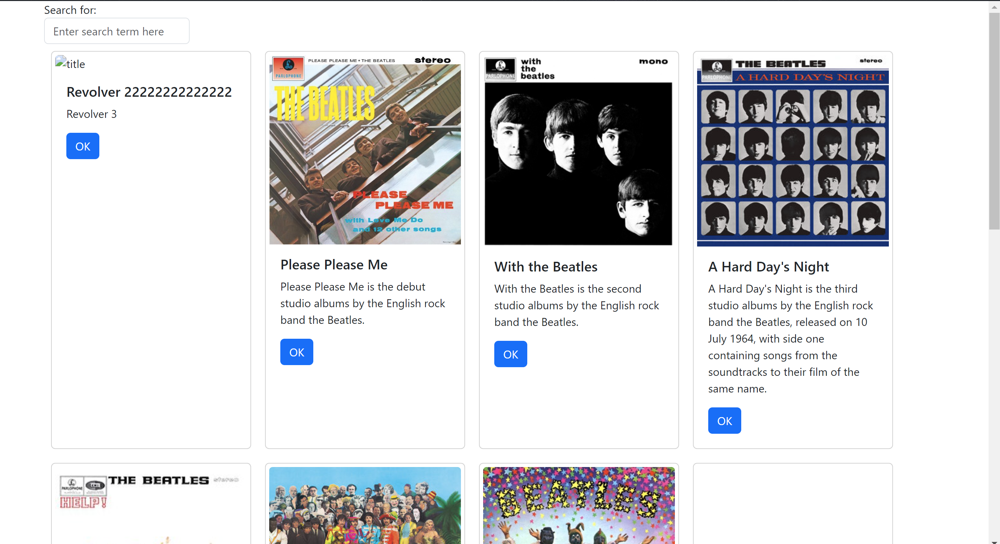

*Figure 4. Application Initialization- displays the Search Form component container above the container with the rendered Album Cards.*

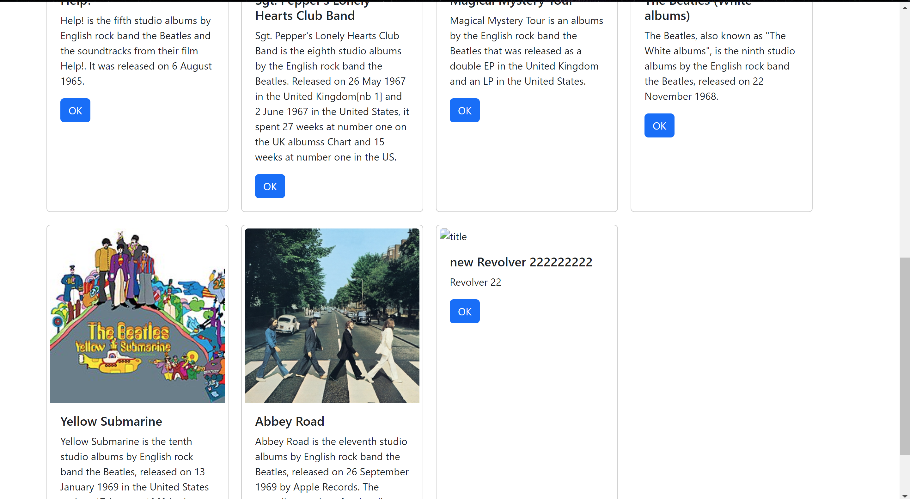

*Figure 5. Application Initialization- upon initialization, the application displays all of the albums in the database.*

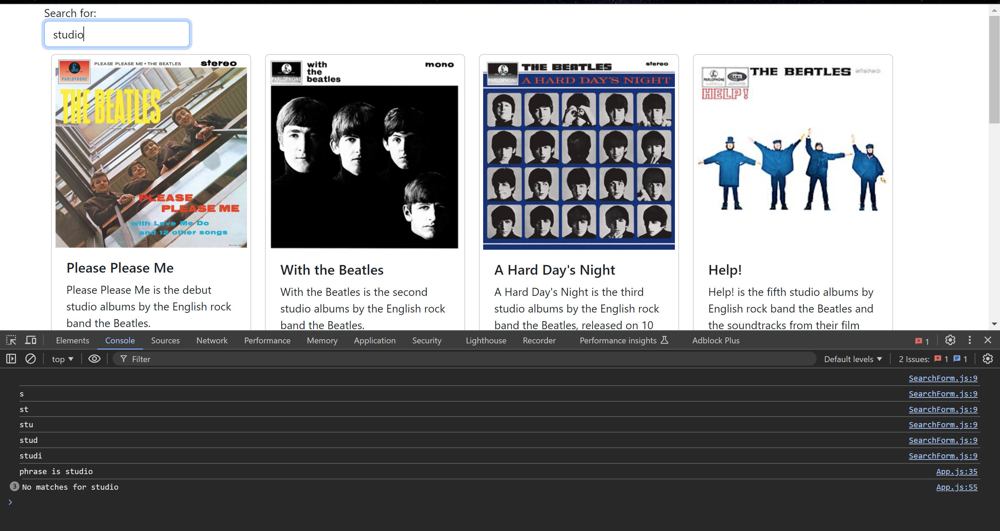

*Figure 6. The image shows the search results for the search phrase "studio". The phrase is matched in the description property of the album.*

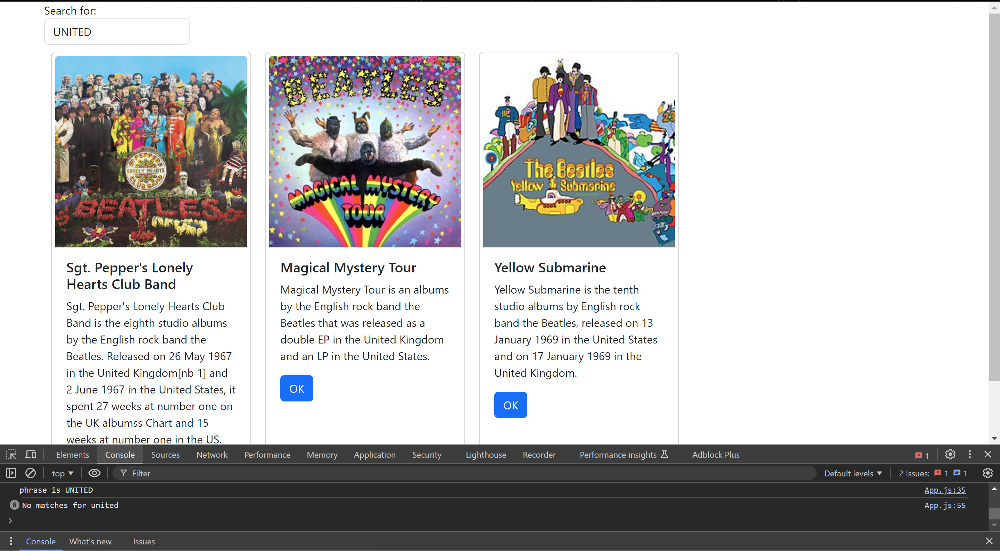

*Figure 7. The image shows the search results for the search phrase "UNITED" displaying that the search is not case sensitive.*

## Mini App #2 - Routing Application Demo

In this application, we will demonstrate the use of a routing library in React. A simple application was created to demonstrate routing and user authorization to navigate to certain pages. The application has an
About Us, Contact Us, Login, and User pages. The Login and User pages are allowed to be visited without logging in, they have no authorization restrictions. The About Us and Contact Us pages require the user to log in to view its content. If the user is not logged in, the Login view, which is a login button will be displayed along with a message telling the user to login. 
The location and navigate hooks and the NAvigate class from react-router-dom library to keep track of the current page we are on and the page we are attempting to navigate to. An isLoggedIn hook is used to keep track if the user has logged in or not. The following images demonstrate the application execution.

### Activity Screenshots

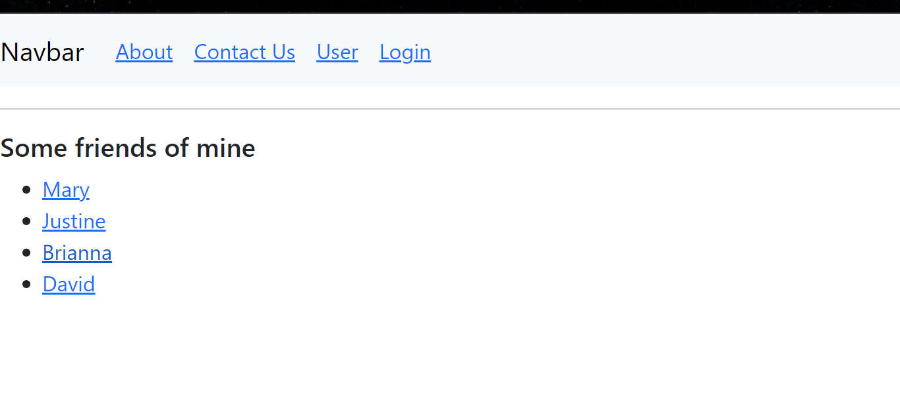 
*Figure 8.  This is what the application looks like upon initialization. A horizontal line was added to separate the root (parent) contents from the child components contents.*

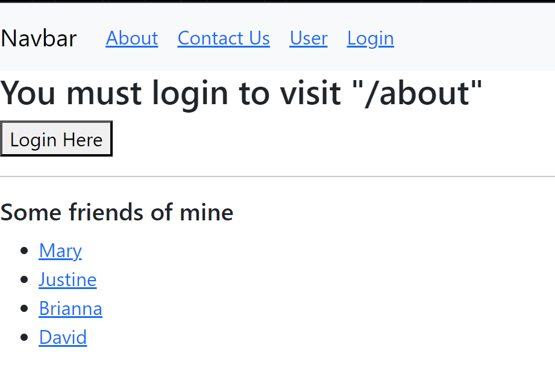
*Figure 9. Upon initialization, the user is not logged in and therefore cannot access the About page. When attempted to do so, the Login component will appear with a prompt to login.*

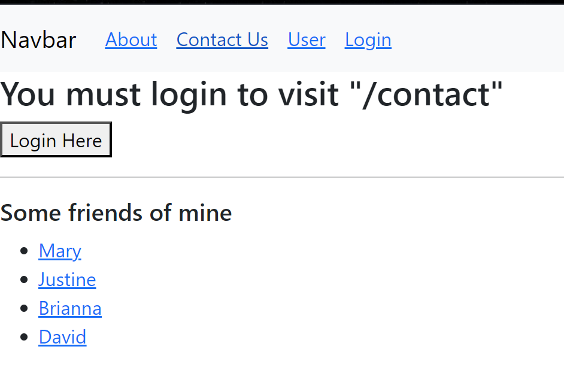
*Figure 10. Upon initialization, the user is not logged in and therefore cannot access the Contact Us page. When attempted to do so, the Login component will appear with a prompt to login.*

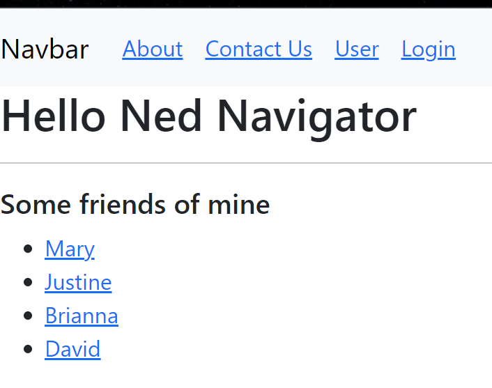
*Figure 11. The User page is one of the two pages that does not have any authorization restrictions. This means that the user does not have to be logged in to view its contents*

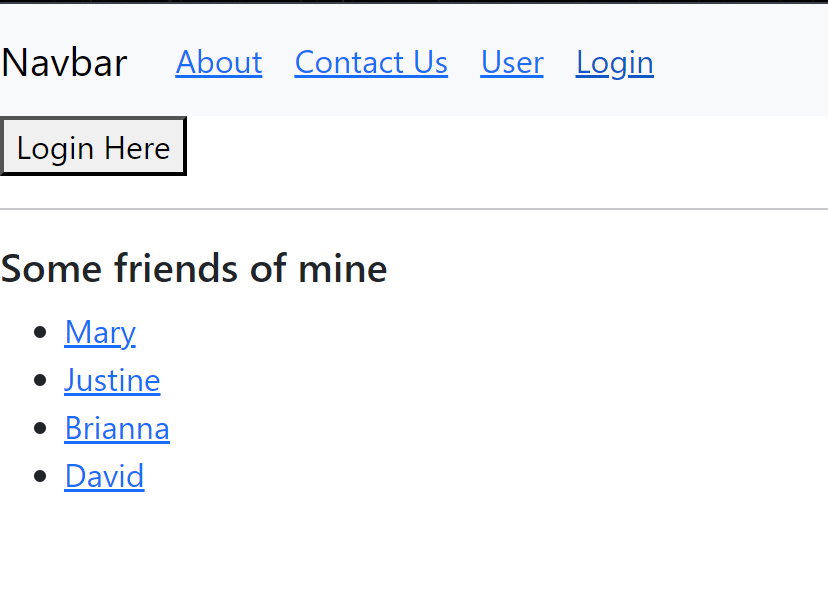
*Figure 12. A button similar to the one in figures 9 and 10 appears then the user is not logged in and clicks on the Login page. However, since user is not attempting to access unauthorized content, the login prompt is not displayed.*

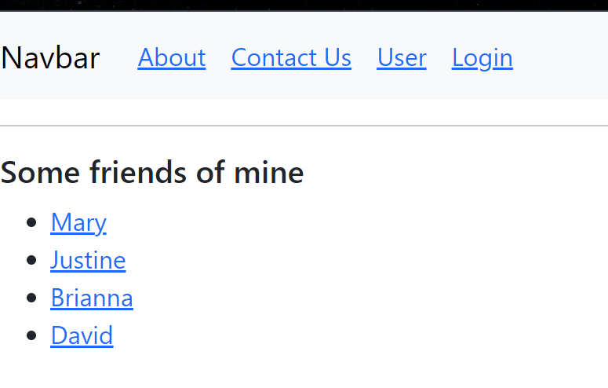
*Figure 13. After the user has logged in in the Login page, the button is no longer displayed.*

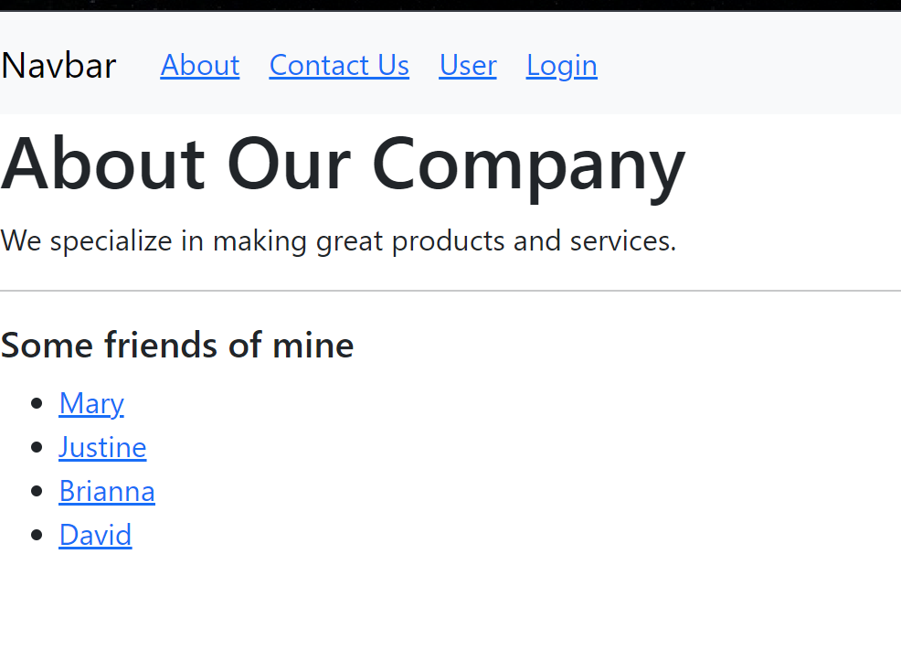
*Figure 14. After user logs in, the About Us content is displayed to the user.*

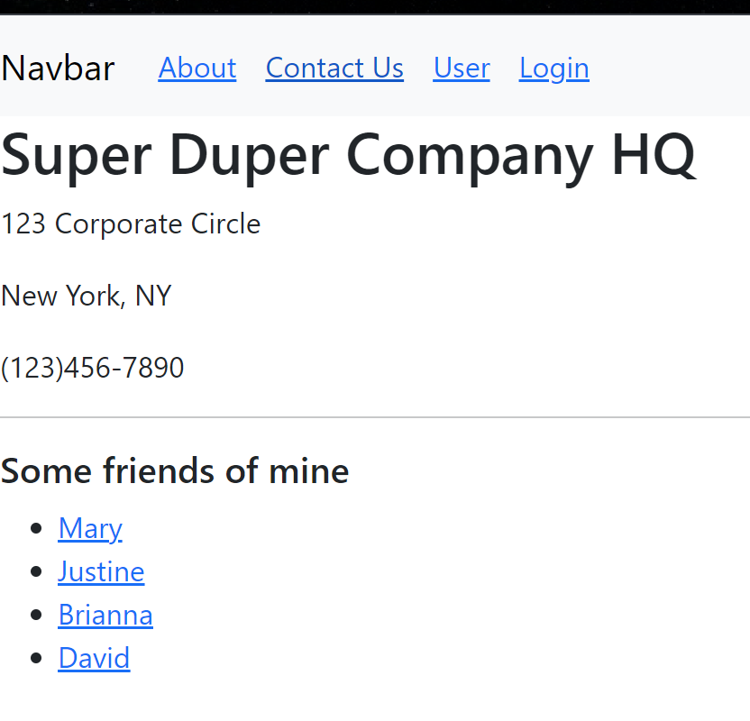
*Figure 15. The Contact Us information is displayed to user after logging in.*

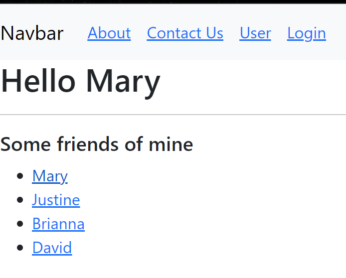
*Figure 16. User Mary selected and Hello message changed to the correct username.*

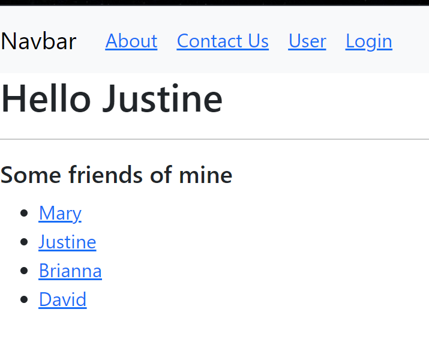
*Figure 17. User Mary selected and Hello message changed to the correct username.*

## Part 4 - Navigation Routing

In this part of the activity, routing was added to the application. The 
[AlbumList](./music/src/AlbumList.js)
component was added to manage the list of album card components. A [SearchAlbum](./music/src/SearchAlbum.js)
component was created to contain the **SearchForm** and **AlbumList** components to be used when performing a search to filter through the albums. 
The [App.js](./music/src/App.js)
file was edited to incorporate all these new components. It is in this file where the routes are defined. 
```JavaScript
<BrowserRouter>
    <NavBar />
    <Routes>
        <Route exact path='/' element= {
            <SearchAlbum
                UpdateSearchResults= {UpdateSearchResults}
                albumList= {renderedList}
                updateSingleAlbum= {updateSingleAlbum}
            /> 
        } />
        <Route exact path='/new' element= {<NewAlbum />} />
            <Route exact path='/show/:albumId' element= {
                <OneAlbum album= {albumList[currentlySelectedAlbumId]} />
        } />
    </Routes>
</BrowserRouter>
```
*Figure 18. App.js Routing*

As shown in the figure above, the application's routes include the **Main** which is the root route, 
[New](./music/src/NewAlbum.js) which will be used to navigate to a create new Album form, and a 
[Show](./music/src/OneAlbum.js)
 route to display the information of a selected Album. Currently we have only two navigation tabs in our 
 [NavBar](./music/src/NavBar.js), 
 the **Main** and **New** options. 

### Activity Screenshots

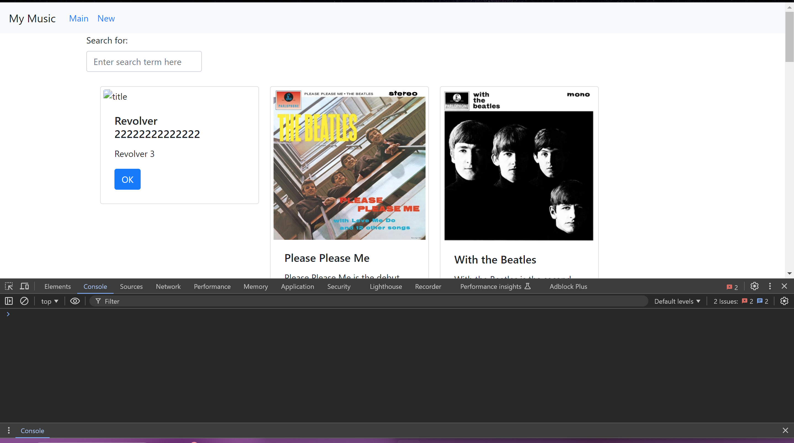
*Figure 19. After minimizing the App.js file content by creating the AlbumList component, the application still initializes by displaying all the albums in the database.*

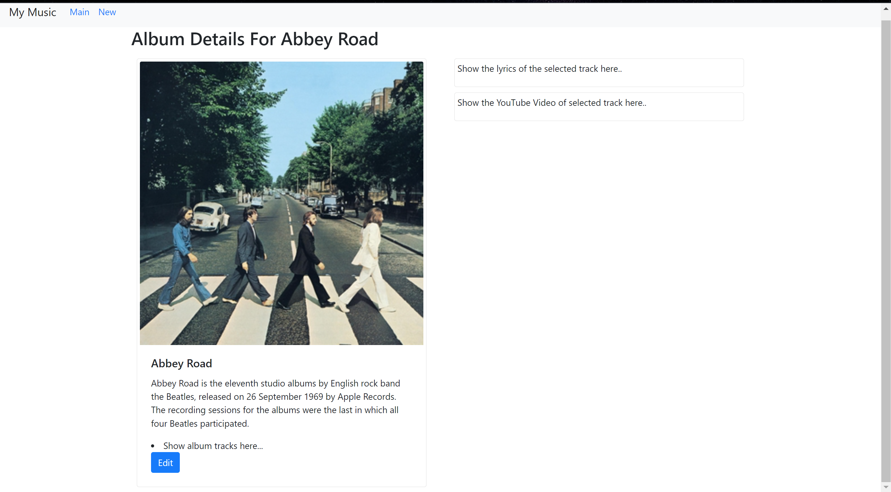
*Figure 20. When clicking the album card button, the OneAlbum component is displayed to show the album details to the user.*


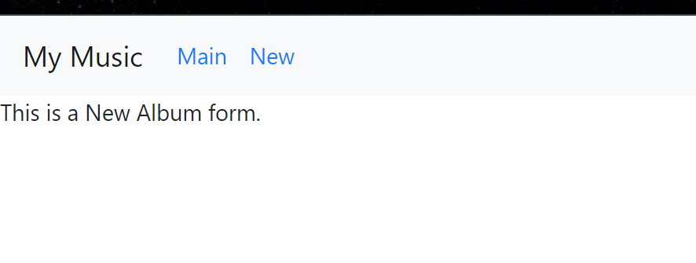
*Figure 21. The **New** tab in the navigation bar successfully allows the user to navigate to the NewAlbum component which is yet to be implemented.*

## Resources:

Grand Canyon University. (n.d.). *CST-391 Activity 6 Guide*. GCU. https://mygcuedu6961.sharepoint.com/:w:/r/sites/CSETGuides/_layouts/15/Doc.aspx?sourcedoc=%7B915F8462-E08C-453B-A9F6-43B324A96150%7D&file=CST-391-RS-Activity6Guide.docx&action=default&mobileredirect=true

*Hooks API Reference*. (n.d.). React. https://legacy.reactjs.org/docs/hooks-reference.html

Manandhar, G. (6 October 2021). *Understanding axios.create*. LogRocket. https://blog.logrocket.com/understanding-axios-create/
