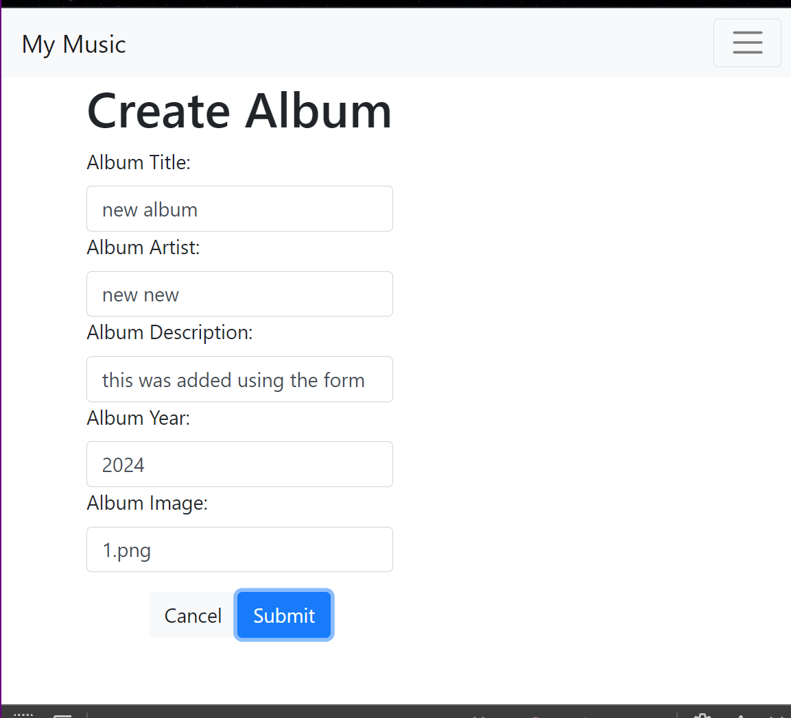

# Activity 7: React Music App Completion

## Mini App #3 - Dynamic Components Demo

In this mini application, we learned to dynamically add and remove components from a page. This application displays a list of Posts with a **delete** option for each. At the bottom the page, a text area and a button is used to add a new post to the list. The post lost and a *postId* counter are kept in the 
[App.js](../blog/src/App.js)
since it is the parent of the 
[Post.js](../blog/src/Post.js) 
component. The **App** component also handles the logic of the *handleDeletePost* and *handleAddPost* methods. The
[AddPost.js](../blog/src/AddPost.js)
component is needed to handle the *handleAddPost* function of this application. The form, a text area and a button, call the function when the button is clicked passing a text value to the App parent component. 

### Application Screenshots

*Figure 1. This is how the application looks upon initialization. The 4 current posts displayed are hardcoded in the **App.js** file.*

*Figure 2. Clicking the **delete** button in any of the Post containers will delete that specified post. Here, post id numbers 0 and 2 have been deleted.*

*Figure 3. Post entry #4 was added using the **AddPost** component. After clicking the **Add** button, the post is added to the list and the postId counter in **App.js** is incremented.*

## Part 5 - Tracks Lyrics, and Video - Optional

## Part 6 - Create New Album

In this part of the application, we created a
[NewAlbum.js](../music/src/NewAlbum.js)
form to be able to create a new album in our music library. The form includes a series of labels, input boxes, and hooks to get the *title*, *artist*, *description*, *year*, and *image* values of the new album from the user. Two buttons are present in the form, a *cancel* button cancels the function and returns the user to the main screen, meanwhile the submit button creates a new album and then, returns the album details screen.

### Application Screenshots

*Figure 4. This is the contents of the **NewAlbum** form when the user clicks on the *New* tab in the navigation bar.*

*Figure 5. These are the album values inputted to create a new Album.*

*Figure 6. When the user submits the Album details, they are redirected to the **OneAlbum** form where the details of the Album just created are displayed to the user.*

## Part 7: Edit an Album

In this last part of the application, the we implemented the ability to edit existing albums with the 
[EditAlbum.js](../music/src/EditAlbum.js)
component. This component displays a similar form that the previous **NewAlbum** component did and there for this new component can also be used to replace the **NewAlbum.js** file. 

The **EditAlbum** assumes that a new album is being created so it creates and initializes an album object to blank default values. The album creation will change these default values to the values the user input in the form. To enable Editing, a *newAlbumCreation* boolean (initialized as *true*) is used to change to false if an album was provided in props, meaning we already have an album to edit it. As mentioned, both actions render the same form but either use the props.album to edit or the new default album to create a new album. After performing either action, the user is redirected to the main page with the list of all the albums. This is also true when the user clicks *Cancel* to cancel either action.

### Application Screenshots

*Figure 7. This is the **EditAlbum** form to create a new album, when no album is provided in props.*

*Figure 8. These are the values input into the form to create a new album.*

*Figure 9. A new album can be created by clicking the *New* navigation bar tab. This used the **EditAlbum.js** file to display a *Create Album* form.*

*Figure 10. Details of the new album created.*

*Figure 11. An existing album can be edited. Input boxes will display their current values and these can be altered and submitted. These are the changes made on the previously created album.*

*Figure 12. This is the album edited details.*

